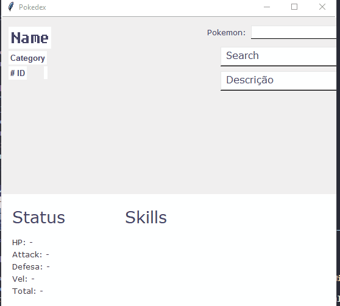

<h1 align="center">Pokedex Project</h1>

    <li><a href="#descript">Description</a></li>
    <li><a href="#work">Working</a></li>
    <li><a href="#tec">Technologies</a></li>

 

<h3 id="descript">Description</h3>

Project created using only python.

    The project was created using OOP, the consumption of an API from the website <a href="https://pokeapi.co">https://pokeapi.co</a>, finally an interface was made for better user interaction.

 

<h3 id="work">Project Working</h3>

 

<h3 id="tec">Technologies</h3>
 

this project was created using pure <b>Python</b>

